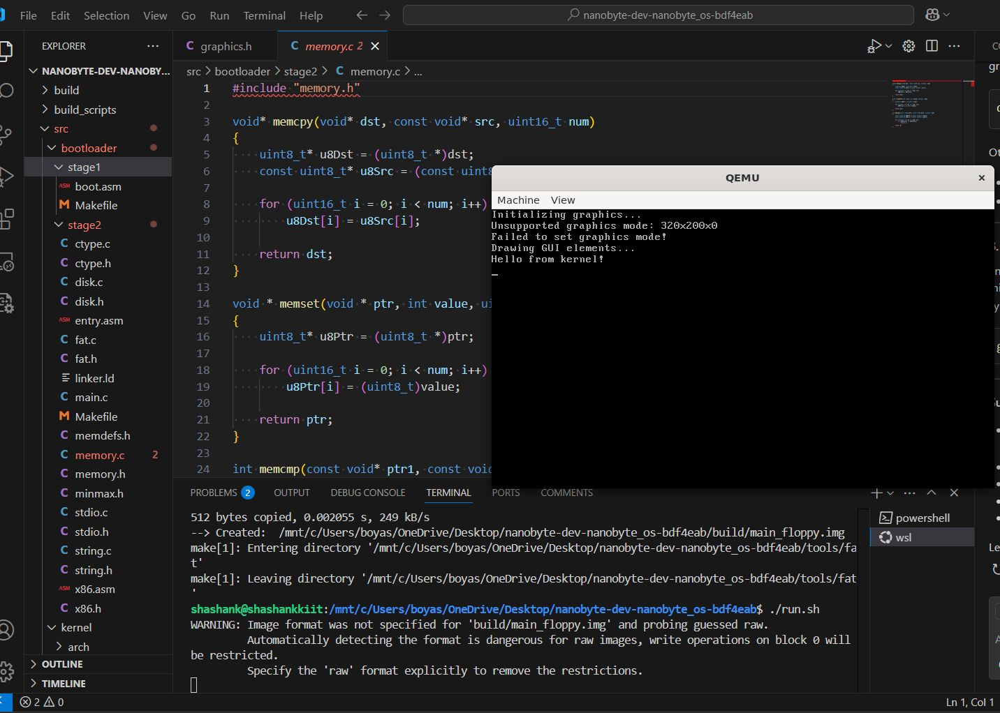

# x86-os_Guided_Minor_Project
Welcome to the **x86-os_Guided_Minor_Project** repository! This project is an educational initiative aimed at developing a simple operating system from scratch for x86 architecture. It serves as a guided minor project to deepen understanding of low-level system programming and OS concepts.


## Table of Contents

- [Project Overview](#project-overview)
- [Features](#features)
- [Directory Structure](#directory-structure)
- [Getting Started](#getting-started)
- [Building the OS](#building-the-os)
- [Running the OS](#running-the-os)
- [Contributing](#contributing)
- [License](#license)

## Project Overview

The goal of this project is to build a basic operating system that can:

- Boot on x86 architecture
- Display simple text output
- Serve as a foundation for further OS development

This project is intended for educational purposes and is a work in progress. Contributions and suggestions are welcome!

## Features

- Bootloader implementation
- Kernel written in C and Assembly
- Basic screen output functionality
- Makefile for build automation
- Scripts for building and running the OS

## Directory Structure
.<br>
├── build/ # Compiled binaries and ISO images<br>
├── build_scripts/ # Scripts to automate the build process<br>
├── run/ # Files related to running the OS<br>
├── src/ # Source code for the OS (C and Assembly)<br>
├── tools/ # Tools and utilities for development<br>
├── Makefile # Build automation file<br>
├── run.sh # Script to run the OS in an emulator<br>
└── README.md # Project documentation<br>


## Getting Started

### Prerequisites

To build and run this project, you need the following tools installed on your system:

- **GCC**: GNU Compiler Collection
- **NASM**: Netwide Assembler
- **QEMU**: Emulator for running the OS

### Installation

#### On Ubuntu/Debian:

```bash
sudo apt update
sudo apt install build-essential nasm qemu
```

#### On Arch Linux:

```bash
sudo pacman -S base-devel nasm qemu
```

#### On macOS (using Homebrew):

```bash
sudo pacman -S base-devel nasm qemu
```

## Building the OS

To build the operating system, navigate to the project directory and run:

```bash
make
```
This command will compile the source code and generate the necessary binaries in the build/ directory.

## Running the OS

After building the project, you can run the OS using QEMU:

```bash
make
```
This script will launch the OS in a QEMU virtual machine, allowing you to test its functionality.

## Contributing

Contributions are welcome! If you have suggestions for improvements or want to add new features, feel free to fork the repository and submit a pull request.

## Steps to Contribute

1. Fork the repository
2. Create a new branch: `git checkout -b feature-name`
3. Make your changes and commit them: `git commit -m 'Add feature'`
4. Push to the branch: `git push origin feature-name`
5. Open a pull request

Please ensure your code adheres to the project's coding standards and includes appropriate documentation.